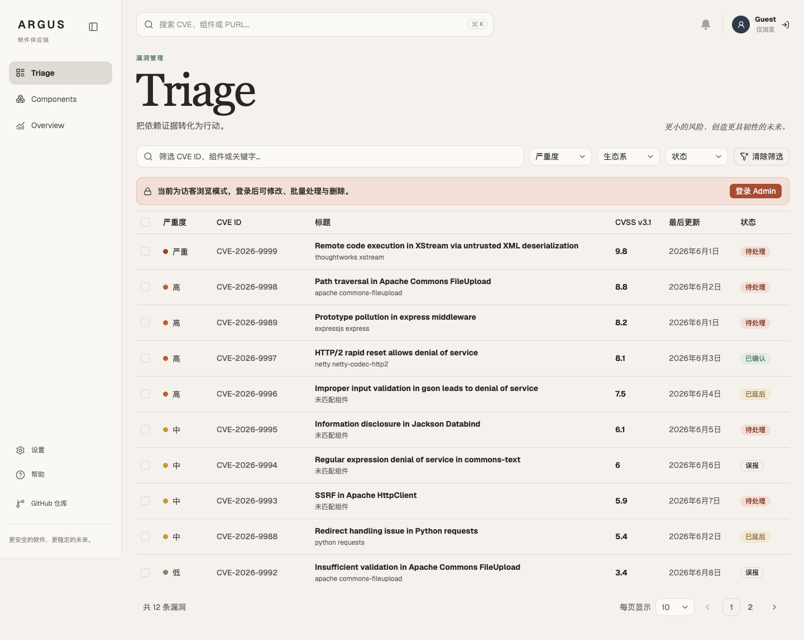
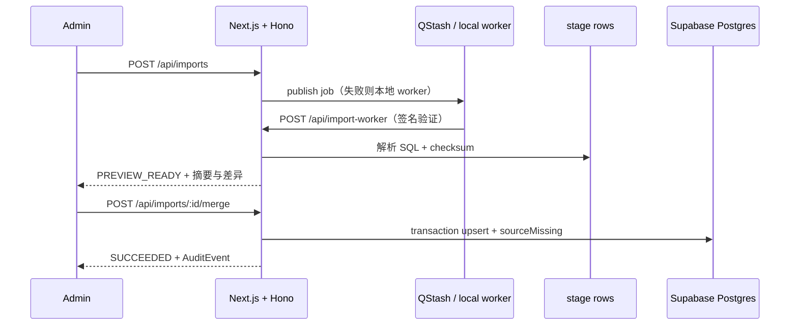

<div align="center">
  <h1>Argus</h1>
  <p>面向 DevSecOps 与安全审查人员的漏洞分流工作台</p>
  <p><a href="https://argus-vulnerability-triage.vercel.app">在线体验</a> · <a href="#快速开始">本地运行</a> · <a href="#外部服务配置">配置服务</a></p>
  <p>
    <a href="https://github.com/BlackishGreen33/Argus/actions/workflows/ci.yml"></a>
    
    
    
    
  </p>
</div>



## 目录

- [为什么使用 Argus](#为什么使用-argus)
- [功能](#功能)
- [技术基线](#技术基线)
- [快速开始](#快速开始)
- [环境变量](#环境变量)
- [外部服务配置](#外部服务配置)
- [数据与架构](#数据与架构)
- [API](#api)
- [开发与验证](#开发与验证)
- [部署到 Vercel](#部署到-vercel)
- [项目结构](#项目结构)

## 为什么使用 Argus

漏洞数据通常同时包含来源字段、评分、影响范围和组件关系。Argus 把这些证据放在同一条审查路径上：先在 Overview 看风险分布，再在 Triage 中筛选和分流，最后通过详情抽屉、History 与 AuditEvent 保留决策上下文。

这个路径将“看到一个漏洞”变成了“知道为什么处理、处理到哪一步、下一次如何复核”：

- 来源 SQL 经过标准化解析，并用 checksum 保证重复导入可识别。
- CVE 的本地 triage 状态与来源字段分离，刷新数据不会覆盖管理判断。
- CPE 关系使用候选模型展示，界面明确标注“可能关联，需人工确认”。
- 删除会保留操作事件；CVE 不开放人工新增，避免破坏来源可信度。

## 功能

| 模块 | 能力 |
| --- | --- |
| Triage | 按 CVE ID、标题、描述、Component、PURL 搜索；按严重度、生态系统、状态筛选 |
| 全局搜索 | 顶部搜索支持 CVE、Component、PURL，并提供 `Cmd/Ctrl + K` 命令入口 |
| 详情抽屉 | Overview、Impact、History；Admin 可直接修改状态 |
| CVE 管理 | 编辑标题、描述、severity、CVSS、CWE、受影响版本；确认后硬删除并写入 AuditEvent |
| Components | PURL、类型、名称、版本、供应商、CPE、许可证、仓库链接的完整 CRUD |
| Overview | 真实 severity／生态系统分布、未处理 Critical／High、Argus Risk Index、导入预览 |
| 导入 | `comp.sql`／`vul.sql` 解析、checksum、stage rows、preview、transaction merge、sourceMissing、重试 |
| 权限 | Guest 只读；Admin 才能编辑、删除、批量改状态、审查候选关系和导入合并 |
| 可访问性 | 简体中文 UI、响应式布局、键盘关闭、焦点提示、reduced motion、loading／empty／error／success |

## 技术基线

| 层 | 选择 |
| --- | --- |
| Runtime | Node.js 24.x、pnpm 12.6.0 |
| Web | Next.js 16 App Router、官方 Turbopack、TailwindCSS v4 |
| UI | shadcn/ui 风格基础、Rare UI／Kibo UI／Cult UI 视觉参考、Motion、Tremor 风格图表 |
| API | Hono REST API、Zod 校验、OpenAPI JSON、`/api/docs` 文档入口 |
| Database | Supabase Postgres、Prisma 7.10、可重复 migration 与 seed |
| Auth | Supabase Auth；Email／Password，Google 与 GitHub 按 Provider 配置显示 |
| Async workflow | Upstash QStash；无凭证时回退本地 worker，便于离线运行 |
| Deploy | Vercel |
| Quality | Vitest、Playwright、GitHub Actions |

## 快速开始

### 环境要求

- Node.js `24.x`
- pnpm `12.6.0`（项目锁定版本）
- Docker（仅运行本地 Supabase 堆栈需要；云端 Supabase 不需要）

首次安装 pnpm：`npm install --global pnpm@12.6.0`。先用 `node --version` 确认正在使用 Node.js 24。

### 启动 Demo mode

```bash
git clone https://github.com/BlackishGreen33/Argus.git
cd Argus
pnpm install --frozen-lockfile
cp .env.example .env.local
pnpm db:generate
pnpm dev
```

打开 <http://localhost:3000>。默认 `DEMO_MODE=true`，不配置数据库即可浏览 6 个 Component 与 12 条示范 CVE。示范条目用于体验交互，不作为真实安全公告。`data/source/` 另含 398 个 Component 与 1000 条 CVE 的导入数据。

> [!TIP]
> Demo mode 使用内存数据与演示登录，修改会在服务重启后恢复。需要持久化和真实 Admin 权限时，再配置 Supabase 并设置 `DEMO_MODE=false`。

### 使用真实 Postgres

先按下方 Supabase 步骤填写 `.env.local`，设置 `DEMO_MODE=false`，然后执行：

```bash
pnpm db:generate
pnpm db:migrate
pnpm db:seed
pnpm dev
```

`db:migrate` 和 `db:seed` 会读取 `.env.local`，命令行已有环境变量优先。migration 使用 `DIRECT_URL`；seed 和应用使用 `DATABASE_URL`。SQL 来源文件经过 parser 后写入 Prisma 数据模型，不要直接在 Supabase SQL Editor 执行来源 SQL。

如果选择本地 Supabase，先安装 [Supabase CLI](https://supabase.com/docs/guides/local-development/cli/getting-started) 并启动 Docker，再执行 `supabase start`。使用命令输出中的本地数据库地址、API URL 和 publishable key，替换模板中的云端占位值。

## 环境变量

`.env.local` 只用于本机或部署平台，不要提交。`.env.example` 只包含可公开的变量名与占位值。

### 最小 Demo 配置

```dotenv
DEMO_MODE=true
ADMIN_EMAIL=admin@argus.local
```

### 持久化与登录配置

| 变量 | 必需场景 | 用途 | 获取位置 |
| --- | --- | --- | --- |
| `DEMO_MODE` | 所有环境 | `true` 使用内存数据与演示登录；`false` 使用配置好的 Postgres 与 Supabase Auth | 手动设置 |
| `ADMIN_EMAIL` | Admin 登录 | 邮箱等于该值的 Supabase 用户拥有 Admin 权限 | 手动设置为你的管理邮箱 |
| `DATABASE_URL` | `DEMO_MODE=false` | 应用运行时连接 Postgres；Vercel 建议使用 Supabase Transaction Pooler | Supabase → 项目顶部 Connect |
| `DIRECT_URL` | migration | Prisma migration 使用的直连或 Session Pooler 地址 | Supabase → 项目顶部 Connect |
| `NEXT_PUBLIC_SUPABASE_URL` | `DEMO_MODE=false` | Supabase 项目 URL | Supabase → Connect |
| `NEXT_PUBLIC_SUPABASE_PUBLISHABLE_KEY` | `DEMO_MODE=false` | Supabase Publishable key（`sb_publishable_...`） | Supabase → Settings → API Keys |
| `AUTH_GOOGLE_ENABLED` | 使用 Google | `true` 后显示 Google 登录按钮 | Supabase Auth Provider 配置完成后手动设置 |
| `AUTH_GITHUB_ENABLED` | 使用 GitHub | `true` 后显示 GitHub 登录按钮 | Supabase Auth Provider 配置完成后手动设置 |

### QStash 与 Redis 配置

| 变量 | 必需场景 | 用途 | 获取位置 |
| --- | --- | --- | --- |
| `QSTASH_TOKEN` | 需要云端异步导入 | 发布导入任务、重试任务 | Upstash Console → QStash → Tokens |
| `QSTASH_CURRENT_SIGNING_KEY` | 需要签名校验 | 校验 `/api/import-worker` 请求 | Upstash Console → QStash → Signing Keys |
| `QSTASH_NEXT_SIGNING_KEY` | 轮换签名密钥 | QStash 密钥轮换时的下一把 key | Upstash Console → QStash → Signing Keys |
| `QSTASH_URL` | Vercel 部署后推荐 | 明确指定 `https://你的域名/api/import-worker` | Vercel 部署地址或自定义域名 |
| `UPSTASH_REDIS_REST_URL`、`UPSTASH_REDIS_REST_TOKEN` | 当前不需要 | 现有页面与导入流程没有调用 Redis，可留空 | 若以后启用：Upstash → Redis → 数据库 → REST API |

`.env.local` 的真实环境示例：

```dotenv
DEMO_MODE=false
ADMIN_EMAIL=you@example.com

DATABASE_URL="postgresql://...pooler.supabase.com:6543/postgres?pgbouncer=true"
DIRECT_URL="postgresql://...pooler.supabase.com:5432/postgres"
NEXT_PUBLIC_SUPABASE_URL="https://your-project.supabase.co"
NEXT_PUBLIC_SUPABASE_PUBLISHABLE_KEY="your-publishable-or-anon-key"

AUTH_GOOGLE_ENABLED=false
AUTH_GITHUB_ENABLED=false

QSTASH_TOKEN="your-qstash-token"
QSTASH_CURRENT_SIGNING_KEY="your-current-signing-key"
QSTASH_NEXT_SIGNING_KEY="your-next-signing-key"
QSTASH_URL="https://your-project.vercel.app/api/import-worker"
```

## 外部服务配置

### Supabase

1. 在 [Supabase Dashboard](https://supabase.com/dashboard) 创建项目，保存数据库密码。数据库密码用于连接字符串，和 Supabase 账号的登录密码、API key 不同。
2. 打开项目顶部 **Connect**。Transaction Pooler（端口 `6543`）填入 `DATABASE_URL`；Session Pooler（端口 `5432`）填入 `DIRECT_URL`。将连接字符串的密码占位符换成数据库密码；密码含 `@`、`#`、`/` 等特殊字符时需 URL 编码。直连地址需要 IPv6 或额外的 IPv4 支持，普通本机网络优先用 Session Pooler。[连接指南](https://supabase.com/docs/guides/database/prisma)
3. 从 **Connect** 复制项目 URL，从 **Settings → API Keys** 复制 Publishable key（`sb_publishable_...`），分别填写 `NEXT_PUBLIC_SUPABASE_URL` 和 `NEXT_PUBLIC_SUPABASE_PUBLISHABLE_KEY`。[API key 类型](https://supabase.com/docs/guides/getting-started/api-keys)
4. 本项目所有业务数据经 Hono／Prisma 访问；在 Supabase API Settings 关闭 Data API，避免通过自动生成的数据接口绕过应用权限。Supabase Auth 保持启用。
5. 在 **Authentication → Providers / Sign In** 启用 Email。在 **Authentication → Users → Add user** 创建管理员，邮箱与 `ADMIN_EMAIL` 一致，并设置登录密码；关闭公开注册。Supabase 默认的邮箱确认开启时，先完成邮箱确认。
6. 在 **Authentication → URL Configuration** 将 Site URL 设为部署域名，Redirect URLs 添加 `http://localhost:3000/` 与 `https://argus-vulnerability-triage.vercel.app/`。自部署时替换成自己的域名。
7. 设置 `DEMO_MODE=false`，执行上方 migration 与 seed 命令；启动后以管理员邮箱和密码登录。

> [!IMPORTANT]
> `NEXT_PUBLIC_SUPABASE_PUBLISHABLE_KEY` 只能放 Publishable key。`service_role`、`sb_secret_...` 和数据库密码不能放进任何 `NEXT_PUBLIC_*` 变量；此项目不需要 Supabase service-role key。

### Google／GitHub 登录（可选）

先完成 Email 登录配置，再启用社交登录。Provider 的 Client Secret 填在 Supabase 控制台；Argus 的 `.env.local` 只需要对应启用开关。

| Provider | 创建凭证 | 回调与启用 |
| --- | --- | --- |
| Google | [Google Cloud Console](https://console.cloud.google.com/) → Google Auth Platform，配置 Branding、Audience；在 Clients 创建 Web application 类型 OAuth Client，取得 Client ID／Secret | 将 Supabase Google Provider 页面提供的 `https://<project-ref>.supabase.co/auth/v1/callback` 添加到 Authorized redirect URIs；测试模式添加管理员为测试用户。在 Supabase 填入 ID／Secret 并启用后设 `AUTH_GOOGLE_ENABLED=true`。[官方步骤](https://supabase.com/docs/guides/auth/social-login/auth-google) |
| GitHub | [GitHub Developer Settings](https://github.com/settings/developers) → OAuth Apps → New OAuth App，取得 Client ID，并 Generate a new client secret | Homepage URL 填部署域名；Authorization callback URL 填 Supabase GitHub Provider 页面提供的相同格式回调。在 Supabase 填入 ID／Secret 并启用后设 `AUTH_GITHUB_ENABLED=true`。[官方步骤](https://supabase.com/docs/guides/auth/social-login/auth-github) |

社交账号的已验证邮箱也必须等于 `ADMIN_EMAIL`，才能取得 Admin 权限。

### Upstash QStash

1. 登录 [Upstash Console](https://console.upstash.com/)，进入 **QStash**，在控制台取得 Token、Current Signing Key 和 Next Signing Key，分别填入 `QSTASH_TOKEN`、`QSTASH_CURRENT_SIGNING_KEY`、`QSTASH_NEXT_SIGNING_KEY`。[开始使用](https://upstash.com/docs/qstash/overall/getstarted)
2. 将 `QSTASH_URL` 设置为 `https://argus-vulnerability-triage.vercel.app/api/import-worker`；自部署时替换域名。
3. 云端 worker 需要 `DEMO_MODE=false` 和已迁移的 Postgres，才能跨请求保存任务状态。回调必须能被 QStash 公网访问；本机 `localhost` 不可作为云端回调。
4. 在 Vercel 加入这四个变量并重新部署。没有 QStash 时，本地常驻服务可执行内置 worker；Serverless 部署请配置 QStash，不依赖进程内后台任务的生命周期。

Redis 当前没有被业务流程调用，无需另建 Redis 数据库或提供 Redis token。

> [!TIP]
> QStash 与 Redis 都是可选项。缺少 QStash 时，导入任务会在当前请求中执行本地 worker fallback；配置 QStash 后才启用延迟、重试和签名校验。

### Vercel

1. 在 [Vercel](https://vercel.com/) 导入 Git 仓库，Framework Preset 选 Next.js，Node.js 选 `24.x`。本仓库已有 [在线部署](https://argus-vulnerability-triage.vercel.app)。
2. 打开项目 **Settings → Environment Variables**，将 `.env.local` 的生产配置逐项填入 Production 环境。Preview／Development 按需单独配置；`DIRECT_URL` 仅本机或 migration 执行环境需要，当前 Vercel build 不执行数据库迁移。
3. Supabase 变量齐全后设 `DEMO_MODE=false`。只配置本机 `.env.local` 不会更新 Vercel；平台环境变量修改后必须重新部署。[环境变量说明](https://vercel.com/docs/environment-variables)
4. 将最终域名填入 Supabase Redirect URLs 与 `QSTASH_URL`，确认 `/api/health`、列表、登录和管理员修改均正常。

## 数据与架构

SQL 来源文件位于：

```text
data/source/comp.sql
data/source/vul.sql
```

导入流程如下：



## API

- `GET /api/cves`、`GET /api/cves/:cveId`
- `PATCH /api/cves/:cveId`、`PATCH /api/cves/:cveId/status`、`DELETE /api/cves/:cveId`
- `POST /api/cves/batch-status`
- `GET|POST /api/components`、`PATCH|DELETE /api/components/:purl`
- `PATCH /api/cpe-candidates/:id`
- `GET /api/search`、`GET /api/overview`、`GET /api/audit-events`
- `POST /api/imports`、`GET /api/imports/:id`、`POST .../merge`、`POST .../retry`
- `POST /api/import-worker`、`GET /api/openapi.json`、`GET /api/docs`

错误响应统一为 `{ ok: false, error: { message, details? } }`；成功响应使用 `{ data, meta? }`。

## 开发与验证

```bash
pnpm lint
pnpm typecheck
pnpm test
pnpm exec playwright install chromium
pnpm test:e2e
pnpm build
```

CI 使用独立 jobs 分别执行 Lint and format、Typecheck、Unit tests、Prisma schema and migrations、Production build 与 Playwright E2E；失败 job 名称直接对应责任边界。数据库 migration 与持久化验收需要配置真实 Postgres 后另行执行。

## 部署到 Vercel

部署前请确保：

- GitHub 仓库已经包含 `data/source/comp.sql` 与 `data/source/vul.sql`。
- `DEMO_MODE=true` 可公开体验示例数据与演示登录，变更不持久化；它不提供真实单管理员认证。
- 真实持久化部署已填写 `DATABASE_URL`、`DIRECT_URL` 与 Supabase 变量。
- 使用 QStash 时已填写签名 key，并已把 Vercel URL 配置到 `QSTASH_URL`。

## 项目结构

```text
Argus/
├── src/
│   ├── app/                         # Next layout、页面与 Hono API
│   ├── components/                  # 页面切片与可交互 UI
│   ├── hooks/                       # 快捷键、Toast 等客户端交互
│   ├── libs/                        # parser、store、auth、Prisma、QStash
│   ├── types/                       # domain 与 UI contract
│   └── utils/                       # HTTP、格式化与文案映射
├── data/source/                     # SQL 来源数据
├── prisma/                          # schema、migration、seed
├── public/argus-screenshot.png      # 实际运行截图
├── tests/                           # Vitest parser tests
├── e2e/                             # Playwright smoke test
├── .github/workflows/ci.yml         # GitHub Actions
├── .env.example                     # 环境变量模板
└── README.md
```

## 相关文档

- [技术决策](./docs/decisions.md)
- [风险登记表](./docs/risk-register.md)
- [测试矩阵](./docs/test-matrix.md)
- [AI 使用记录](./docs/ai-log.md)
- [发布前检查表](./docs/release-checklist.md)
- [开发看板说明](./docs/project-board.md)

## 参考

- [Next.js 16](https://nextjs.org/docs/app/guides/upgrading/version-16)
- [Hono for Next.js](https://hono.dev/docs/getting-started/nextjs)
- [Prisma 7 系统要求](https://www.prisma.io/docs/orm/v7/reference/system-requirements)
- [Supabase + Prisma](https://supabase.com/docs/guides/database/prisma)
- [WCAG 2.2](https://www.w3.org/TR/wcag/)
- [ARIA Authoring Practices](https://www.w3.org/WAI/ARIA/apg/)

## 致谢

- [Rare UI](https://www.rareui.com/)：Delete Button 与 Notification Bell 元件，依其 MIT with Commons Clause 授權要求保留來源連結。
