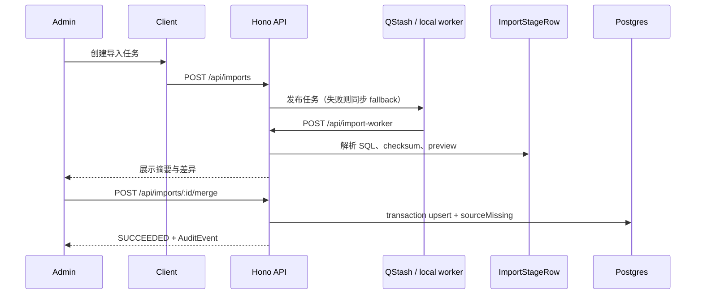

<div align="center">
  <h1>Argus</h1>
  <p>面向 DevSecOps 与安全审查人员的漏洞分流工作台</p>
  <p><a href="https://argus-vulnerability-triage.vercel.app">在线体验</a> · <a href="#快速开始">本地运行</a> · <a href="#外部服务配置">配置服务</a></p>
  <p>
    <a href="https://github.com/BlackishGreen33/Argus/actions/workflows/ci.yml"></a>
    
    
    
    
  </p>
</div>


## 目录

- [产品定位](#产品定位)
- [功能范围](#功能范围)
- [技术基线](#技术基线)
- [快速开始](#快速开始)
- [环境变量](#环境变量)
- [外部服务配置](#外部服务配置)
- [数据与架构](#数据与架构)
- [API 快速摘要](#api-快速摘要)
- [开发与验证](#开发与验证)
- [部署到 Vercel](#部署到-vercel)
- [项目结构](#项目结构)
- [文档路由](#文档路由)

## 产品定位

Argus 把来源字段、评分、影响范围和组件关系放进同一条审查路径：在 Overview 查看风险分布，在 Triage 中筛选和分流，再通过详情抽屉、History 与 AuditEvent 保留决策上下文。CVE 只从内置 SQL 导入，Component 提供独立 CRUD，CPE 关系以候选形式展示并要求人工确认。

## 功能范围

| 模块       | 能力                                                                                                    |
| ---------- | ------------------------------------------------------------------------------------------------------- |
| Triage     | 按 CVE ID、标题、描述、Component、PURL 搜索；按严重度、生态系统、状态筛选                               |
| 全局搜索   | 搜索 CVE、Component、PURL；支持 `Cmd/Ctrl + K` 命令入口                                                 |
| 详情抽屉   | 展示 Overview、Impact、History；Admin 可快速修改 triage 状态                                            |
| CVE        | 编辑来源映射字段；Admin 确认后硬删除并写入 AuditEvent；不提供人工新增                                   |
| Components | PURL、类型、名称、版本、供应商、CPE、许可证、仓库链接的完整 CRUD                                        |
| Overview   | 展示真实 severity／生态系统分布、未处理 Critical／High、Risk Index 和导入状态                           |
| 导入       | 解析 `comp.sql`／`vul.sql`，保留 checksum、stage rows、preview、transaction merge、sourceMissing 和重试 |
| 权限       | Guest 只读；Admin 才能编辑、删除、批量改状态、审查候选关系和执行导入                                    |
| 可访问性   | 简体中文 UI、响应式布局、键盘关闭、焦点提示、reduced motion、loading／empty／error／success 状态        |

## 技术基线

| 层       | 选择                                              | 详细取舍                                                  |
| -------- | ------------------------------------------------- | --------------------------------------------------------- |
| Runtime  | Node.js 24.x、pnpm 12.6.0                         | 版本来自 `package.json`                                   |
| Web      | Next.js 16 App Router、Turbopack、Tailwind CSS v4 | 使用官方 Next 构建链                                      |
| Client   | Axios、TanStack Query、Jotai、Motion              | 请求、远端数据生命周期、跨页 UI 状态和动效各自负责        |
| UI       | 本地 UI 组件、Radix、React Aria                   | 外部来源组件的授权说明见文末；不把 Rare UI 当作 npm 依赖  |
| API      | Hono、Zod、OpenAPI JSON                           | Next adapter 位于 `src/app/api/[[...route]]/route.ts`     |
| Database | Supabase Postgres、Prisma 7.10                    | migration、seed、transaction 和 upsert                    |
| Auth     | Supabase Auth、`DEMO_MODE`                        | Email／Password；Google 和 GitHub 按 Provider 配置显示    |
| Async    | Upstash QStash、Upstash Redis（可选）             | 没有 QStash 时同步执行导入；没有 Redis 时回退数据库／内存 |
| Deploy   | Vercel Hobby                                      | 面向公开展示，不承诺生产 SLA                              |
| Quality  | Vitest、Playwright、GitHub Actions                | 命令和覆盖范围见 [测试矩阵](./docs/test-matrix.md)        |

长期技术取舍只记录在 [技术决策](./docs/decisions.md)，本表只帮助读者选择运行路径。

## 快速开始

### 环境要求

- Node.js `24.x`
- pnpm `12.6.0`
- Docker 只在运行本地 Supabase 堆栈时需要

首次安装 pnpm：

```bash
npm install --global pnpm@12.6.0
```

### 启动 Demo mode

```bash
git clone https://github.com/BlackishGreen33/Argus.git
cd Argus
pnpm install --frozen-lockfile
cp .env.example .env.local
pnpm db:generate
pnpm dev
```

打开 <http://localhost:3000>。模板默认使用 `DEMO_MODE=true`，无需数据库即可浏览 6 个 Component 和 12 条示范 CVE。示范数据只用于体验交互，不代表真实安全公告；`data/source/` 另有内置 SQL 来源数据。

Demo mode 的修改保存在内存中，服务重启后恢复。需要持久化和真实 Admin 权限时，按下节配置 Supabase，并设 `DEMO_MODE=false`。

### 使用真实 Postgres

先填写 `.env.local`，设置 `DEMO_MODE=false`，再执行：

```bash
pnpm db:generate
pnpm db:migrate
pnpm db:seed
pnpm dev
```

`DATABASE_URL` 用于应用和 seed，`DIRECT_URL` 用于 Prisma migration。SQL 来源文件必须经过 parser 写入 Prisma 数据模型，不要直接在 Supabase SQL Editor 执行来源 SQL。

如果使用本地 Supabase，安装 [Supabase CLI](https://supabase.com/docs/guides/local-development/cli/getting-started)，启动 Docker 后执行 `supabase start`，再将命令输出的数据库地址、API URL 和 publishable key 填入模板。

## 环境变量

`.env.local` 只用于本机或部署平台，不要提交；`.env.example` 只保留变量名和安全占位值。

| 变量                                                                                  | 必需场景          | 用途                                                                            |
| ------------------------------------------------------------------------------------- | ----------------- | ------------------------------------------------------------------------------- |
| `DEMO_MODE`                                                                           | 所有环境          | `true` 使用内存数据和 Demo 登录；`false` 使用 Postgres 与 Supabase Auth         |
| `ADMIN_EMAIL`                                                                         | Admin 登录        | 邮箱等于该值的 Supabase 用户取得 Admin 权限                                     |
| `DATABASE_URL`                                                                        | `DEMO_MODE=false` | 应用运行时连接 Postgres；Vercel 建议使用 Supabase Transaction Pooler            |
| `DIRECT_URL`                                                                          | migration         | Prisma migration 使用的直连或 Session Pooler 地址                               |
| `NEXT_PUBLIC_SUPABASE_URL`                                                            | `DEMO_MODE=false` | Supabase 项目 URL                                                               |
| `NEXT_PUBLIC_SUPABASE_PUBLISHABLE_KEY`                                                | `DEMO_MODE=false` | Publishable key（`sb_publishable_...`）；不能填 service role 或 `sb_secret_...` |
| `AUTH_GOOGLE_ENABLED`                                                                 | 使用 Google       | Supabase Provider 完成配置后设为 `true`                                         |
| `AUTH_GITHUB_ENABLED`                                                                 | 使用 GitHub       | Supabase Provider 完成配置后设为 `true`                                         |
| `UPSTASH_REDIS_REST_URL`、`UPSTASH_REDIS_REST_TOKEN`                                  | 可选              | 为列表、搜索、Overview、Audit API 提供短 TTL 读缓存                             |
| `QSTASH_TOKEN`、`QSTASH_CURRENT_SIGNING_KEY`、`QSTASH_NEXT_SIGNING_KEY`、`QSTASH_URL` | 云端异步导入      | 发布任务、验证 worker 回调和支持密钥轮换；四个值一起配置才启用 QStash           |

最小 Demo 配置：

```dotenv
DEMO_MODE=true
ADMIN_EMAIL=admin@argus.local
```

真实环境示例只能使用占位符，不能把密钥、数据库密码或 token 提交到仓库：

```dotenv
DEMO_MODE=false
ADMIN_EMAIL=you@example.com
DATABASE_URL="postgresql://...pooler.supabase.com:6543/postgres?pgbouncer=true"
DIRECT_URL="postgresql://...pooler.supabase.com:5432/postgres"
NEXT_PUBLIC_SUPABASE_URL="https://your-project.supabase.co"
NEXT_PUBLIC_SUPABASE_PUBLISHABLE_KEY="your-publishable-key"
AUTH_GOOGLE_ENABLED=false
AUTH_GITHUB_ENABLED=false
UPSTASH_REDIS_REST_URL=""
UPSTASH_REDIS_REST_TOKEN=""
QSTASH_TOKEN=""
QSTASH_CURRENT_SIGNING_KEY=""
QSTASH_NEXT_SIGNING_KEY=""
QSTASH_URL="https://your-domain.example/api/import-worker"
```

## 外部服务配置

### Supabase

1. 创建项目，在 **Connect** 获取 Transaction Pooler 和 Session Pooler 连接字符串，分别填写 `DATABASE_URL` 和 `DIRECT_URL`。密码含特殊字符时先 URL 编码。
2. 从 **Connect** 复制项目 URL，从 **Settings → API Keys** 复制 Publishable key，填写两个 `NEXT_PUBLIC_*` 变量。
3. 业务数据只经 Hono／Prisma 访问；Supabase Data API 不应成为绕过应用权限的第二条业务路径。
4. 在 **Authentication → Providers / Sign In** 启用 Email，在 **Users** 创建邮箱等于 `ADMIN_EMAIL` 的管理员，并关闭公开注册。
5. 在 **URL Configuration** 填入部署域名，并添加本地 `http://localhost:3000/` 和生产回调地址。
6. 设 `DEMO_MODE=false`，执行 migration 和 seed，再用 Admin 账号登录。

数据库密码只能出现在连接字符串的 server 环境变量中。不要把数据库密码、`service_role`、`sb_secret_...` 放入任何 `NEXT_PUBLIC_*` 变量。

### Google／GitHub 登录

先完成 Email 登录，再在 Supabase Provider 中配置 OAuth 客户端和回调地址。Argus 只用 `AUTH_GOOGLE_ENABLED` 或 `AUTH_GITHUB_ENABLED` 控制按钮显示，Client Secret 留在 Supabase 控制台；社交账号的已验证邮箱也必须等于 `ADMIN_EMAIL`。

- [Supabase Google 登录步骤](https://supabase.com/docs/guides/auth/social-login/auth-google)
- [Supabase Auth 配置](https://supabase.com/docs/guides/auth)

### Upstash QStash 与 Redis

QStash 需要公网可访问的 `QSTASH_URL`，回调地址使用 `/api/import-worker`。Vercel Serverless 不应依赖进程内后台任务；没有 QStash 时本地 worker 会在当前请求中运行。

Redis 只提供读缓存。CVE、Component、候选、通知和导入等写操作会清除相关缓存；连接或写入失败时回退数据库／内存，不阻塞页面读取。

- [QStash 开始使用](https://upstash.com/docs/qstash/overall/getstarted)
- [Upstash Redis](https://upstash.com/docs/redis)

### Vercel

1. 导入 Git 仓库，Framework Preset 选择 Next.js，Node.js 选择 `24.x`。
2. 在 **Settings → Environment Variables** 填入生产环境变量；`DIRECT_URL` 通常只用于本机或 migration 环境。
3. 设置 `DEMO_MODE=false` 后重新部署。环境变量变更不会自动改变已经部署的构建。
4. 在 Supabase Redirect URLs 和 `QSTASH_URL` 中使用最终域名，并回读 `/api/health`、列表、登录和 Admin mutation。

## 数据与架构

来源文件是 `data/source/comp.sql` 和 `data/source/vul.sql`。前端只通过 `src/client/http.ts` 调用 REST API；API adapter 进入 Hono route，再由领域 service 访问 Prisma、缓存或可选队列。



持久化模型、字段枚举和 request schema 的机器来源分别是 `prisma/schema.prisma`、`src/types/domain.ts`、`src/constants/status.ts` 和 `src/server/api/schemas.ts`。README 只保留运行路径；长期取舍见 [技术决策](./docs/decisions.md)。

## API 快速摘要

所有业务接口挂在 `/api` 下。成功响应使用 `{ data, meta? }`，错误响应使用 `{ ok: false, error: { message, details? } }`。

| 领域               | 路径                                                                                                                                                                                   |
| ------------------ | -------------------------------------------------------------------------------------------------------------------------------------------------------------------------------------- |
| System             | `GET /api/health`、`GET /api/docs`、`GET /api/openapi.json`                                                                                                                            |
| Auth               | `GET /api/auth/providers`、`GET /api/auth/me`、`POST /api/auth/demo-login`、`POST /api/auth/login`、`GET /api/auth/oauth/:provider`、`GET /api/auth/callback`、`POST /api/auth/logout` |
| CVE                | `GET /api/cves`、`GET /api/cves/:cveId`、`GET /api/search`、`PATCH /api/cves/:cveId`、`PATCH /api/cves/:cveId/status`、`POST /api/cves/batch-status`、`DELETE /api/cves/:cveId`        |
| Component          | `GET                                                                                                                                                                                   | POST /api/components`、`PATCH | DELETE /api/components/:purl`、`PATCH /api/cpe-candidates/:id` |
| Overview and audit | `GET /api/overview`、`GET /api/audit-events`                                                                                                                                           |
| Import             | `POST /api/imports`、`GET /api/imports/:id`、`POST /api/imports/:id/merge`、`POST /api/imports/:id/retry`、`POST /api/import-worker`                                                   |

Guest 可执行只读 GET；Admin 才能执行 mutation、批量状态和导入操作。服务端通过 `resolveUser` 判断权限，前端隐藏按钮不能代替 API 授权。路由实现以 `src/server/api/routes/` 为准，新增或删除路由时必须同步检查本节、OpenAPI 和测试矩阵。

## 开发与验证

常用命令：

```bash
pnpm lint
pnpm format:check
pnpm typecheck
pnpm test
pnpm test:e2e
pnpm build
```

完整安装和数据库流程见上文。发布前还要执行 `pnpm prisma validate`、必要的 migration／seed，以及浏览器走查；覆盖场景和证据字段见 [测试矩阵](./docs/test-matrix.md) 与 [发布前检查表](./docs/release-checklist.md)。`pnpm check` 只包含 lint、format、typecheck 和 unit tests，不等于完整发布 gate。

## 部署到 Vercel

部署前确认：

- 仓库包含 `data/source/comp.sql` 和 `data/source/vul.sql`。
- `DEMO_MODE=true` 只适合公开体验，数据修改不持久化，也不提供真实单管理员认证。
- 真实持久化部署已填写 `DATABASE_URL`、`DIRECT_URL` 和 Supabase 变量。
- 使用 QStash 时已同时填写 token、两把 signing key 和公网 `QSTASH_URL`。
- 部署后已回读健康检查、登录、Guest 读取和 Admin mutation。

## 项目结构

```text
Argus/
├── src/app/                    # 页面、layout、全局样式和 API adapter
├── src/client/                 # Axios、QueryProvider、hooks、Jotai state
├── src/components/             # 页面切片与 UI
├── src/constants/              # 状态、分页、主题和产品常量
├── src/i18n/                   # 客户端与服务端文案
├── src/server/api/routes/      # auth、CVE、Component、Import、system
├── src/server/services/        # 领域 service 与共享 store façade
├── src/server/data/            # parser 与 Demo 数据
├── src/server/db/              # Prisma client
├── src/server/cache/           # Redis 可选缓存
├── src/server/jobs/            # QStash 与导入 worker
├── prisma/                     # schema、migration、seed
├── data/source/                # SQL 来源文件
├── tests/                      # Vitest
├── e2e/                        # Playwright
├── .github/workflows/ci.yml   # CI jobs
└── .env.example                # 环境变量模板
```

## 文档路由

| 主题                                 | 文档                                                     |
| ------------------------------------ | -------------------------------------------------------- |
| 代理规则、文档路由、数据和安全不变量 | [AGENTS.md](./AGENTS.md)                                 |
| UI 视觉与交互契约                    | [DESIGN.md](./DESIGN.md)                                 |
| 当前范围、里程碑和交付要求           | [docs/plan.md](./docs/plan.md)                           |
| 长期技术决策                         | [docs/decisions.md](./docs/decisions.md)                 |
| 验证覆盖与证据                       | [docs/test-matrix.md](./docs/test-matrix.md)             |
| 发布门槛                             | [docs/release-checklist.md](./docs/release-checklist.md) |
| 风险登记                             | [docs/risk-register.md](./docs/risk-register.md)         |
| AI 来源记录                          | [docs/ai-log.md](./docs/ai-log.md)                       |
| 看板流程                             | [docs/project-board.md](./docs/project-board.md)         |

## 参考与致谢

- [Next.js 16](https://nextjs.org/docs/app/guides/upgrading/version-16)
- [Hono for Next.js](https://hono.dev/docs/getting-started/nextjs)
- [Jotai](https://jotai.org/)
- [Axios](https://axios-http.com/)
- [Prisma 7 系统要求](https://www.prisma.io/docs/orm/v7/reference/system-requirements)
- [Supabase + Prisma](https://supabase.com/docs/guides/database/prisma)
- [WCAG 2.2](https://www.w3.org/TR/wcag/)
- [ARIA Authoring Practices](https://www.w3.org/WAI/ARIA/apg/)

- `src/components/ui/delete-button.tsx` 和 `src/components/ui/notification-bell.tsx` 是仓库中的自有 UI 文件，保留其来源与授权链接；Rare UI 不作为运行时依赖安装。
- [Rare UI](https://www.rareui.com/)：Delete Button 与 Notification Bell 的来源／授权参考。
