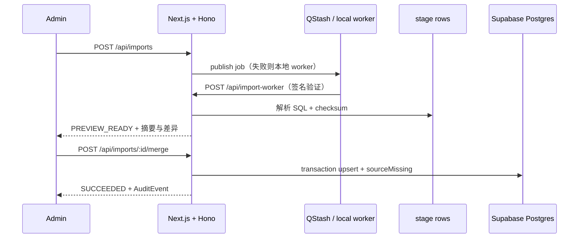

<div align="center">
  <h1>Argus</h1>
  <p>面向 DevSecOps 与安全审查人员的漏洞分流工作台</p>
  <p>
    <a href="https://github.com/BlackishGreen33/argus-vulnerability-triage/actions/workflows/ci.yml"></a>
    
    
    
    
  </p>
</div>


> [!IMPORTANT]
> Argus 将 `comp.sql` 与 `vul.sql` 中的供应链证据整理成可搜索、可复核、可分流的工作台。Guest 可以浏览与搜索，Admin 可以修改漏洞、维护 Component、审查候选关系并运行资料刷新。

> [!TIP]
> 项目默认使用 Demo mode，不需要外部服务即可启动。接入 Supabase 后可以切换到真实 Postgres 持久化；接入 QStash 后可以启用签名校验、延迟执行与失败重试。

## 目录

- [为什么使用 Argus](#为什么使用-argus)
- [功能](#功能)
- [技术基线](#技术基线)
- [快速开始](#快速开始)
- [环境变量](#环境变量)
- [外部服务配置](#外部服务配置)
- [数据与架构](#数据与架构)
- [API](#api)
- [开发与验证](#开发与验证)
- [部署到 Vercel](#部署到-vercel)
- [项目结构](#项目结构)

## 为什么使用 Argus

漏洞数据通常同时包含来源字段、评分、影响范围和组件关系。Argus 把这些证据放在同一条审查路径上：先在 Overview 看风险分布，再在 Triage 中筛选和分流，最后通过详情抽屉、History 与 AuditEvent 保留决策上下文。

这个路径将“看到一个漏洞”变成了“知道为什么处理、处理到哪一步、下一次如何复核”：

- 来源 SQL 经过标准化解析，并用 checksum 保证重复导入可识别。
- CVE 的本地 triage 状态与来源字段分离，刷新数据不会覆盖管理判断。
- CPE 关系使用候选模型展示，界面明确标注“可能关联，需人工确认”。
- 删除会保留操作事件；CVE 不开放人工新增，避免破坏来源可信度。

## 功能

| 模块 | 能力 |
| --- | --- |
| Triage | 按 CVE ID、标题、描述、Component、PURL 搜索；按严重度、生态系统、状态筛选 |
| 全局搜索 | 顶部搜索支持 CVE、Component、PURL，并提供 `Cmd/Ctrl + K` 命令入口 |
| 详情抽屉 | Overview、Impact、History；Admin 可直接修改状态 |
| CVE 管理 | 编辑标题、描述、severity、CVSS、CWE、受影响版本；确认后硬删除并写入 AuditEvent |
| Components | PURL、类型、名称、版本、供应商、CPE、许可证、仓库链接的完整 CRUD |
| Overview | 真实 severity／生态系统分布、未处理 Critical／High、Argus Risk Index、导入预览 |
| 导入 | `comp.sql`／`vul.sql` 解析、checksum、stage rows、preview、transaction merge、sourceMissing、重试 |
| 权限 | Guest 只读；Admin 才能编辑、删除、批量改状态、审查候选关系和导入合并 |
| 可访问性 | 简体中文 UI、响应式布局、键盘关闭、焦点提示、reduced motion、loading／empty／error／success |

## 技术基线

| 层 | 选择 |
| --- | --- |
| Runtime | Node.js 24.x、pnpm 12.6.0 |
| Web | Next.js 16 App Router、官方 Turbopack、TailwindCSS v4 |
| UI | shadcn/ui 风格基础、Rare UI／Kibo UI／Cult UI 视觉参考、Motion、Tremor 风格图表 |
| API | Hono REST API、Zod 校验、OpenAPI JSON、`/api/docs` 文档入口 |
| Database | Supabase Postgres、Prisma 7.10、可重复 migration 与 seed |
| Auth | Supabase Auth；Email／Password，Google 与 GitHub 按 Provider 配置显示 |
| Async workflow | Upstash QStash；无凭证时回退本地 worker，便于离线运行 |
| Deploy | Vercel |
| Quality | Vitest、Playwright、GitHub Actions |

## 快速开始

### 环境要求

- Node.js `24.x`
- pnpm `12.6.0`（当前 `pnpm@latest`）
- Docker（仅真实 Postgres 验证或本地 Supabase 堆栈需要）

### 启动 Demo mode

```bash
git clone https://github.com/BlackishGreen33/argus-vulnerability-triage.git
cd argus-vulnerability-triage
fnm exec --using v24.15.0 -- corepack pnpm@12.6.0 install
cp .env.example .env.local
fnm exec --using v24.15.0 -- corepack pnpm@12.6.0 dev
```

打开 <http://localhost:3000>。默认 `DEMO_MODE=true`，不配置数据库也可以浏览 398 个 Component 与 1000 条 CVE 的演示数据。

### 使用真实 Postgres

```bash
supabase start
# 在 .env.local 设置 DATABASE_URL、DIRECT_URL、NEXT_PUBLIC_SUPABASE_*，并改为 DEMO_MODE=false
fnm exec --using v24.15.0 -- corepack pnpm@12.6.0 db:generate
fnm exec --using v24.15.0 -- corepack pnpm@12.6.0 db:migrate
fnm exec --using v24.15.0 -- corepack pnpm@12.6.0 db:seed
fnm exec --using v24.15.0 -- corepack pnpm@12.6.0 dev
```

## 环境变量

`.env.local` 只用于本机或部署平台，不要提交。`.env.example` 只包含可公开的变量名与占位值。

### 最小 Demo 配置

```dotenv
DEMO_MODE=true
ADMIN_EMAIL=admin@argus.local
```

### 持久化与登录配置

| 变量 | 必需场景 | 用途 | 获取位置 |
| --- | --- | --- | --- |
| `DEMO_MODE` | 所有环境 | `true` 使用内存 Demo；`false` 使用 Supabase 与真实认证 | 手动设置 |
| `ADMIN_EMAIL` | Admin 登录 | 邮箱等于该值的 Supabase 用户拥有 Admin 权限 | 手动设置为你的管理邮箱 |
| `DATABASE_URL` | `DEMO_MODE=false` | 应用运行时连接 Postgres；Vercel 建议使用 Supabase Transaction Pooler | Supabase → Project Settings → Database → Connect |
| `DIRECT_URL` | migration／seed | Prisma migration 使用的直连或 Session Pooler 地址 | Supabase → Project Settings → Database → Connect |
| `NEXT_PUBLIC_SUPABASE_URL` | `DEMO_MODE=false` | Supabase 项目 URL | Supabase → Project Settings → API |
| `NEXT_PUBLIC_SUPABASE_ANON_KEY` | `DEMO_MODE=false` | 浏览器安全可用的 anon key | Supabase → Project Settings → API |
| `AUTH_GOOGLE_ENABLED` | 使用 Google | `true` 后显示 Google 登录按钮 | Supabase Auth Provider 配置完成后手动设置 |
| `AUTH_GITHUB_ENABLED` | 使用 GitHub | `true` 后显示 GitHub 登录按钮 | Supabase Auth Provider 配置完成后手动设置 |

### QStash 与 Redis 配置

| 变量 | 必需场景 | 用途 | 获取位置 |
| --- | --- | --- | --- |
| `QSTASH_TOKEN` | 需要云端异步导入 | 发布导入任务、重试任务 | Upstash Console → QStash → Tokens |
| `QSTASH_CURRENT_SIGNING_KEY` | 需要签名校验 | 校验 `/api/import-worker` 请求 | Upstash Console → QStash → Signing Keys |
| `QSTASH_NEXT_SIGNING_KEY` | 轮换签名密钥 | QStash 密钥轮换时的下一把 key | Upstash Console → QStash → Signing Keys |
| `QSTASH_IMPORT_URL` | Vercel 部署后推荐 | 明确指定 `https://你的域名/api/import-worker` | Vercel 部署地址或自定义域名 |
| `UPSTASH_REDIS_REST_URL` | 后续启用 Redis 能力 | Upstash Redis REST endpoint | Upstash Console → Redis → Details |
| `UPSTASH_REDIS_REST_TOKEN` | 后续启用 Redis 能力 | Upstash Redis REST token | Upstash Console → Redis → Details |

`.env.local` 的真实环境示例：

```dotenv
DEMO_MODE=false
ADMIN_EMAIL=you@example.com

DATABASE_URL="postgresql://...pooler.supabase.com:6543/postgres?pgbouncer=true"
DIRECT_URL="postgresql://...db.supabase.co:5432/postgres"
NEXT_PUBLIC_SUPABASE_URL="https://your-project.supabase.co"
NEXT_PUBLIC_SUPABASE_ANON_KEY="your-anon-key"

AUTH_GOOGLE_ENABLED=false
AUTH_GITHUB_ENABLED=false

QSTASH_TOKEN="your-qstash-token"
QSTASH_CURRENT_SIGNING_KEY="your-current-signing-key"
QSTASH_NEXT_SIGNING_KEY="your-next-signing-key"
QSTASH_IMPORT_URL="https://your-project.vercel.app/api/import-worker"
```

## 外部服务配置

### Supabase

1. 在 Supabase 创建项目。
2. 从 **Project Settings → API** 复制 Project URL 与 anon key。
3. 从 **Project Settings → Database → Connect** 复制 Transaction Pooler 地址填写 `DATABASE_URL`；复制直连或 Session Pooler 地址填写 `DIRECT_URL`。
4. 在 **Authentication → Providers** 开启 Email；需要社交登录时再配置 Google／GitHub。
5. 在 **Authentication → URL Configuration** 添加本地 `http://localhost:3000` 与 Vercel 公开地址。
6. 创建一个邮箱等于 `ADMIN_EMAIL` 的用户；登录后即可执行 Admin 操作。

### Upstash QStash

1. 登录 Upstash Console，进入 **QStash** 并创建或复制 Token。
2. 在 QStash 的 Signing Keys 页面复制 Current 与 Next signing key。
3. 首次部署到 Vercel 后，把 `https://你的域名/api/import-worker` 写入 `QSTASH_IMPORT_URL`，再重新部署。
4. 没有 QStash 变量时，Argus 会在本地使用 worker，不影响课堂或离线演示。

### Vercel

1. 登录 Vercel，选择 **Add New → Project → Import Git Repository**。
2. 选择 `BlackishGreen33/argus-vulnerability-triage`，Framework Preset 保持 Next.js。
3. 在 **Settings → Environment Variables** 添加 `.env.local` 中的生产变量；`NEXT_PUBLIC_*` 可以暴露给浏览器，其余变量只放 Server 环境。
4. Node.js 版本选择 `24.x`，点击 Deploy。
5. 部署完成后，将 Vercel 域名补到 Supabase Auth URL Configuration 和 `QSTASH_IMPORT_URL`，然后重新 Deploy。

## 数据与架构

SQL 来源文件位于：

```text
data/source/comp.sql
data/source/vul.sql
```

导入流程如下：



## API

- `GET /api/cves`、`GET /api/cves/:cveId`
- `PATCH /api/cves/:cveId`、`PATCH /api/cves/:cveId/status`、`DELETE /api/cves/:cveId`
- `POST /api/cves/batch-status`
- `GET|POST /api/components`、`PATCH|DELETE /api/components/:purl`
- `PATCH /api/cpe-candidates/:id`
- `GET /api/search`、`GET /api/overview`、`GET /api/audit-events`
- `POST /api/imports`、`GET /api/imports/:id`、`POST .../merge`、`POST .../retry`
- `POST /api/import-worker`、`GET /api/openapi.json`、`GET /api/docs`

错误响应统一为 `{ ok: false, error: { message, details? } }`；成功响应使用 `{ data, meta? }`。

## 开发与验证

```bash
fnm exec --using v24.15.0 -- corepack pnpm@12.6.0 lint
fnm exec --using v24.15.0 -- corepack pnpm@12.6.0 typecheck
fnm exec --using v24.15.0 -- corepack pnpm@12.6.0 test
fnm exec --using v24.15.0 -- corepack pnpm@12.6.0 test:e2e
fnm exec --using v24.15.0 -- corepack pnpm@12.6.0 build
```

CI 使用同一条链路，并额外执行 Prisma validate、Playwright Chromium 与 production build。

## 部署到 Vercel

部署前请确保：

- GitHub 仓库已经包含 `data/source/comp.sql` 与 `data/source/vul.sql`。
- `DEMO_MODE=true` 可以直接部署为公开只读演示。
- 真实持久化部署已填写 `DATABASE_URL`、`DIRECT_URL` 与 Supabase 变量。
- 使用 QStash 时已填写签名 key，并已把 Vercel URL 配置到 `QSTASH_IMPORT_URL`。

## 项目结构

```text
argus-vulnerability-triage/
├── app/
│   ├── api/[[...route]]/route.ts    # Hono REST API
│   ├── components/ArgusApp.tsx      # Triage / Components / Overview
│   └── lib/                         # parser、store、auth、QStash
├── data/source/                     # 教师 SQL 来源数据
├── prisma/                          # schema、migration、seed
├── public/argus-screenshot.png      # 实际运行截图
├── tests/                           # Vitest parser tests
├── e2e/                             # Playwright smoke test
├── .github/workflows/ci.yml         # GitHub Actions
├── .env.example                     # 环境变量模板
└── README.md
```

## 相关文档

- [技术决策](./docs/decisions.md)
- [风险登记表](./docs/risk-register.md)
- [测试矩阵](./docs/test-matrix.md)
- [AI 使用记录](./docs/ai-log.md)
- [发布前检查表](./docs/release-checklist.md)
- [GitHub Projects 看板](./docs/project-board.md)

## 参考

- [Next.js 16](https://nextjs.org/docs/app/guides/upgrading/version-16)
- [Hono for Next.js](https://hono.dev/docs/getting-started/nextjs)
- [Prisma 7 系统要求](https://www.prisma.io/docs/orm/v7/reference/system-requirements)
- [Supabase + Prisma](https://supabase.com/docs/guides/database/prisma)
- [WCAG 2.2](https://www.w3.org/TR/wcag/)
- [ARIA Authoring Practices](https://www.w3.org/WAI/ARIA/apg/)
