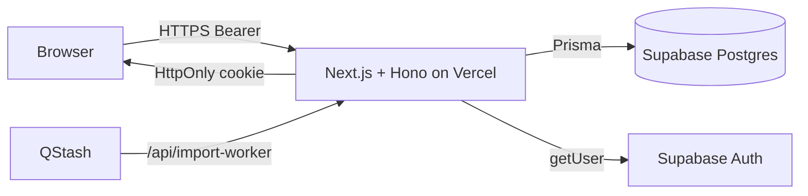
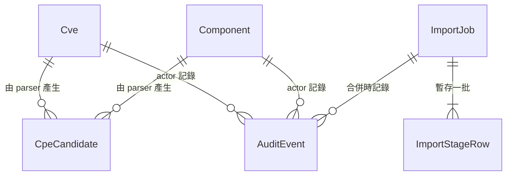
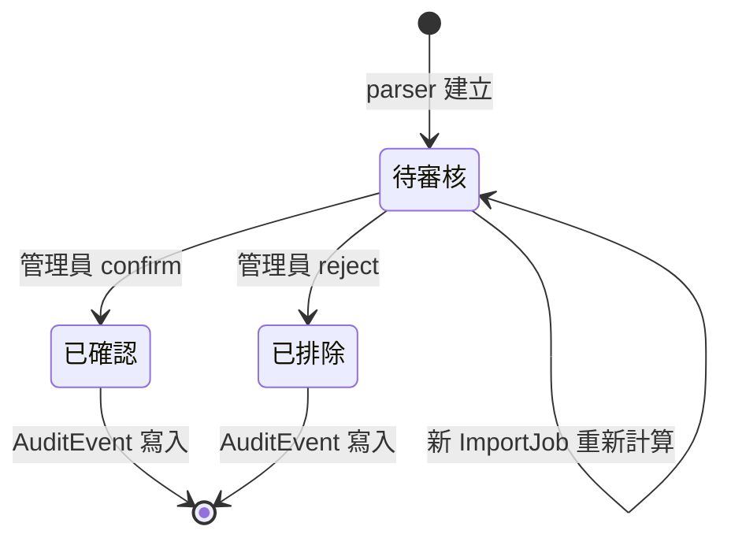
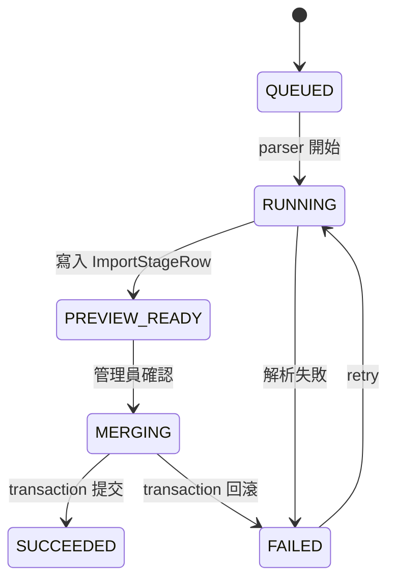
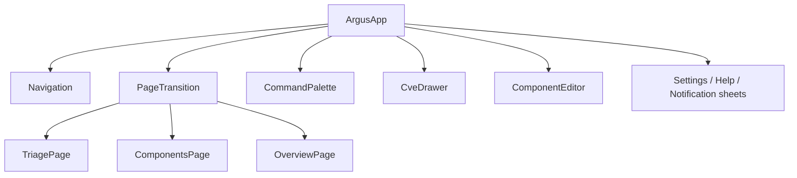

<title>Argus｜漏洞分流工作台：架構、設計與工程實現</title>

# 開場

## 為什麼做 Argus

DevSecOps 在做的事大致是這樣：漏洞資料從多個來源（NVD、OSV、GitHub Advisory⋯⋯）湧進來，每一條都對應著一份正在跑的軟體清單（SBOM、dep graph、套件 manifest）。審查人員每天的動作是看一份漏洞，判斷它**有沒有真的打到我們的程式碼**、**打到哪個版本**、**這個版本現在部署在哪**。這件事沒有自動化的餘地：自動比對會給出大量誤判，最後還是得人工收尾。

Argus 解決的就是這個「最後一公里」：把漏洞與組件兩份事實資料載入主資料庫，由 parser 依 CPE 前綴給出候選關聯，再由管理員在 triage 介面 confirm / reject，並把每一筆決策連同 metadata 留下 audit log，後續匯入也不會抹除。

## 這個 talk 給誰

台下假設有計算機基礎，但未必熟悉漏洞管理、Supabase、TanStack Query 那一整套生態。講到具體工具或術語時會先給一句話定義，再進入設計細節。系統內部命令（`pnpm lint`、`prisma migrate`⋯⋯）會壓到一張表；講重點放在**我們為什麼這樣選**與**實作上踩過什麼坑**。

## 全文地圖

1. **系統架構** — 整體分層與部署形態
2. **領域詞與資料模型** — Argus 在管什麼資料、怎麼管
3. **前端設計與交互** — 三個頁面如何共用狀態
4. **API、權限與資料完整性** — 路由、寫入邊界、審計位置
5. **用 AI 寫這個系統的工作流** — AGENTS.md / DESIGN.md / Skill / Prompt 的分工
6. **質量與驗收** — 測試規模、CI 拆分、驗收案例
7. **結論與後續** — 重做一次會改的部分

---

# 系統架構

## 設計動機

Argus 的修改熱點集中在三個地方：

- **狀態變更**：每一筆 triage 決策都要寫 audit，並讓列表／詳情／Overview 三處 UI 同步更新。
- **資料導入**：兩份 SQL 來源（`comp.sql` 組件、`vul.sql` 漏洞）需要可預覽、可重試、可回滾，不能直接污染主表。
- **權限邊界**：同一個 API 對 Guest 開放查詢、對 Admin 才開放寫入；這個切換必須在 route 邊界一次完成，不能散落到各 page。

只要這三個熱點的修改集中在少數位置，這個系統就具備演進的餘裕。所以 Argus 的分層不是為了「架構乾淨」，而是為了讓上述三類修改只動一處。

## 分層與責任

| 層 | 處理的事 | 不處理的事 |
|---|---|---|
| 頁面（`src/app/`、`src/components/`） | 呈現、查詢快取、輸入校驗的回呼 | 不直接拼 SQL、不繞過 API 拿資料、不寫審計 |
| API（`src/app/api/[[...route]]/route.ts`） | 解析 HTTP、Zod 校驗、`requireAdmin`、回應形狀 | 不寫業務邏輯、不做多步組合 |
| 業務（`src/server/services/store.service.ts`） | 分流決策、候選審核、寫 audit、導入合併 | 不解析 HTTP、不讀 cookie |
| 來源（`src/server/data/parser.ts`） | SQL 引號／轉義／括號深度、CPE 前綴匹配、SHA-256 | 不寫入主表 |
| 資料庫 | 唯一鍵、外鍵、upsert 與 transaction | 不解讀業務 |

寫一次狀態變更的呼叫鏈：

```
Triage 頁 → mutate → /api/cves/{id}/status
       → Zod 校驗 status 列舉值
       → requireAdmin 確認角色
       → store.service.updateStatus({ id, status, actor })
       → Prisma transaction：update Cve + insert AuditEvent
       → 失效 ["argus"] 查詢族
       → 三個頁面重發查詢
```

每一層只做自己該做的事。狀態變更的「同進同出」靠 transaction；UI 同步靠 query 失效。

## 部署形態與執行路徑



正式部署是單體 Next.js 應用：頁面路由與 REST 路由都在同一個專案，Hono 掛在 `/api/*` 下，Client 不論是頁面元件或 Server Action 都只走這層 API。身份由 Supabase Auth 驗 Bearer token；只有 demo 模式（`DEMO_MODE=true`）才用記憶體示範資料，這個分支給靜態展示用，不是開發模式。

QStash 是**可選**的導入 worker 觸發器：配了簽名密鑰就走 QStash HTTP 回呼，沒配就由 import API 同步呼叫同一個 `prepareImportJob`。**兩條路徑共用 parser、checksum 與合併邏輯**，差別只在「誰先呼叫準備函式」。沒配 QStash 的環境（例如本地排查）會走同步分支，受 serverless 函式 timeout 限制（Vercel Hobby 約 10 秒）；遇到大檔案需要改用 QStash 或前端 polling。

> **DEMO_MODE 與 DEV_MODE 沒有關係**。正式路徑要求 `DEMO_MODE=false` 且 `DATABASE_URL` 已配置；`DEMO_MODE=true` 時資料不持久化，重啟即丟。開發時也是真實 DB。

## 目錄結構與模組邊界

```
src/
├── app/                 # Next 路由、layout、全域樣式、/api 入口
├── components/
│   ├── layout/          # Navigation、Settings、Help、Notification
│   ├── triage/          # Triage 頁與其右側 Sheet／編輯器
│   ├── components/      # Components 頁與其編輯器
│   ├── overview/        # Overview 頁與導入任務視圖
│   └── ui/              # React Aria / Radix 二次封裝
├── hooks/               # useArgusQueries、鍵盤快捷鍵、副作用
├── libs/                # store、parser、auth、prisma、qstash、redis
├── types/               # 領域型別與 UI contract
└── utils/               # HTTP client、格式化、文案映射
tests/                   # parser 單元測試
e2e/                     # Playwright 瀏覽器走查
```

`ui/` 與頁面拆開是有意的：UI 元件只負責鍵盤、ARIA、彈層定位；業務狀態由 Argus 自己管。改主題色或字級時不應動到頁面；改 triage 流程時不應動到 `ui/`。

## 技術棧決策對照

| 要解決的問題 | 採取 | 放棄的方案 | 為什麼放棄 |
|---|---|---|---|
| 頁面與 API 共用部署 | Next App Router + Hono | NestJS 獨立 API 服務 | 兩個專案的版本協調成本遠大於單體內部約定 |
| 不可信輸入 | Zod 在 API 入口校驗 | TypeScript 型別斷言 | 型別斷言只是編譯期保護；runtime 仍須驗證 |
| 資料關聯 + 唯一性 + 事務 | Postgres + Prisma 7 | MongoDB | 漏洞與組件的多對多候選關係需要外鍵約束保護 |
| 查詢參數多、修改後多頁同步 | TanStack Query | Redux Toolkit Query | TanStack 的 `invalidateQueries({ queryKey: ['argus'] })` 一行失效整族，狀態機也更小 |
| 導入可背景、可本地排查 | QStash + 同步路徑共用 prepareImportJob | 純背景（無 fallback） | 本地排查時必須能直接呼叫準備函式 |
| 下拉與彈層的無障礙 | React Aria Select/Popover/ListBox | Radix UI / Headless UI | React Aria 對鍵盤與螢幕閱讀器的行為文件最完整 |

---

# 領域詞與資料模型

## 領域詞速覽

後面談資料模型會直接用英文縮寫；這裡先給一句話定義：

- **CVE**（Common Vulnerabilities and Exposures）— 公開漏洞編號，全域唯一。Argus 不新增 CVE，只引用 `vul.sql` 載入的資料。
- **CPE**（Common Platform Enumeration）— 軟體產品的命名字串，形如 `cpe:2.3:a:openssl:openssl:1.0.1`。Argus 用 CPE 前綴做模糊匹配。
- **PURL**（Package URL）— 套件識別字串，形如 `pkg:npm/lodash@4.17.20`。Component 的不可變識別鍵。
- **CVSS**（Common Vulnerability Scoring System）— 漏洞嚴重度評分（0–10），用於排序與主題色分級。
- **CWE**（Common Weakness Enumeration）— 弱點類型分類，用於聚合分析。
- **triage** — 把漏洞依業務風險分流為「待處理 / 已確認 / 已延後 / 誤報」。這是 Argus 的核心動作。
- **audit** — 任何修改、刪除、批量、合併都寫一筆 `AuditEvent`，記錄 actor、action、target、metadata。

## 實體與職責



| 實體 | 主鍵 | 來源 | 主要用途 |
|---|---|---|---|
| `Cve` | `id` (CVE 字串) | `vul.sql` | 漏洞證據 + CVSS + 本地 triage 狀態 |
| `Component` | `id` (PURL) | `comp.sql` | 套件識別、版本、許可證、倉庫 |
| `CpeCandidate` | `(cveId, componentId)` | parser 生成 | 漏洞與組件之間的待審核關聯 |
| `AuditEvent` | `id` | server 端寫入 | 記錄誰、何時、對哪個實體、做什麼動作 |
| `ImportJob` | `id` | server 端建立 | 一次導入的任務；保存 checksum 與狀態 |
| `ImportStageRow` | `(jobId, entity, stableKey)` | parser 寫入 | 該任務的暫存資料；合併前 UI 預覽的對象 |

`Cve.triageStatus` 是本地決策欄位；`vul.sql` 的來源欄位（CVSS、CWE、affected versions）是事實欄位。**重新匯入 `vul.sql` 不會覆蓋 triageStatus**，這是 Argus 對「本地決策」與「來源事實」的最重要邊界。

## 候選匹配邏輯

`CpeCandidate` 不是 CVE 與 Component 的笛卡兒積，而是 CPE 前綴比對的產物。具體規則：同一 CPE 前綴（如 `cpe:2.3:a:openssl:openssl:1.0.1*`）下的漏洞會對應到所有版本後綴相符的 Component。

一個最小例子：若 `vul.sql` 有 CVE-2021-XXX，影響 `cpe:2.3:a:openssl:openssl:1.0.1`；`comp.sql` 同時有 30 個 openssl Component（1.0.1a–1.0.1u），parser 會產生 30 個候選，全部丟給管理員審核。管理員可以全 confirm（接受此風險），全 reject（誤判），或單獨 confirm 某幾個版本。

候選的生命週期：



新 ImportJob 會**重新計算**所有候選；舊的 confirm/reject 不會自動延續，因為來源資料可能改變了影響範圍。每次合併都寫一筆 `AuditEvent` 記錄這次重算。

## 導入流程



1. **解析**：parser 讀 `comp.sql`、`vul.sql`，處理引號、轉義逗號、換行、JSON-like 欄位。計算兩個檔案的 SHA-256（256 bits，輸出 64 個十六進位字元），記到 `ImportJob.sourceChecksum`。
2. **預覽**：寫入 `ImportStageRow`，建立聯合唯一約束 `(jobId, entity, stableKey)`。Overview 頁顯示記錄數與來源樣本。
4. **合併**：管理員按確認後，從**該任務的暫存行**讀取資料，upsert 到主表。

合併的關鍵特性：合併對象不是重新解析檔案，而是從 `ImportStageRow` 讀——所以「確認預覽看到的」與「合併時實際寫入的」是同一批資料。

## 合併事務的邊界

| 寫入 | 在合併 transaction？ | 為什麼這樣放 |
|---|---|---|
| `Component` upsert | 是 | 保證來源更新與本地共同組件同步 |
| `Cve` upsert | 是 | 同上 |
| `CpeCandidate` 重新計算 | 是 | 同上 |
| `sourceMissing` 標記 | 是 | 來源消失的 Component 須一起標 |
| `ImportJob.status = SUCCEEDED` | 是 | 避免假成功 |
| `AuditEvent` | **否** | 若審計與業務 transaction 一起回滾，審計就失去「留下痕跡」的意義 |

這個表格是 Argus 最容易被新成員誤解的設計：**審計在 transaction 外不是 bug，是 feature**。把審計寫進 transaction 內，會在 transaction 回滾時把審計也撤銷，違反 audit log 的「不可磨滅」前提。

---

# 前端設計與交互

## 路由與共享元件



`ArgusApp` 統一持有三類共享狀態：篩選條件與當前頁碼、選中的 CVE、寫入後的查詢失效策略。三個頁面（Triage / Components / Overview）讀取同一份 query，UI 不各持一份。

彈層有三種，語意不同：

| 元件 | 用途 | 何時用 |
|---|---|---|
| `Sheet` | 從右側滑入的詳情或表單 | 查看 CVE 詳情、編輯 Component |
| `Dialog` | 居中、阻斷、需要確認 | 危險操作（刪除、合併確認） |
| `ContextMenu` | 浮層右鍵選單 | 桌面右鍵、手機長按 |

`Sheet` 與 `Dialog` 不混用：詳情用 `Sheet`（保留列表），確認用 `Dialog`（強制回應）。

## 狀態與請求模型

每個 query 都有四種狀態：`loading` / `error` / `empty` / `success`。Mutation 期間停用重複提交，完成後失效 `["argus"]` 整族查詢。

CVE 查詢鍵包含六個欄位：搜尋詞、嚴重度、生態系、狀態、頁碼、每頁數量。任一欄位變動都把頁碼重置為 1。預設 cache 新鮮期 15 秒；使用者身份查詢獨立用 60 秒，並在分頁失焦後允許自動重抓。

寫入後的同步策略採「整族失效」而非「精準失效」：實作簡單、不會漏掉相關 view；代價是部分未受影響的查詢也重抓。Triage 從 query state 派生載入／錯誤／空狀態，skeleton 保留列表空間避免版面抖動。

## 設計規則

| 規則 | 細節 |
|---|---|
| 字體 | Geist 用於界面，Instrument Serif 用於展示標題 |
| 色彩 | canvas / surface / ink / accent 與 severity token 分層；狀態不能只靠顏色傳達（色盲與螢幕閱讀器） |
| 間距 | 4px 為基準，頁面、標題、表格行、表單欄位使用固定 token |
| 動效 | 抽屜、彈層、頁面過渡 180–220ms；尊重 `prefers-reduced-motion` |
| 響應式 | 桌面表格、窄視口切換卡片、可折疊導航、固定操作區 |
| 元件複用 | `Select` 封裝 React Aria 的 Select/Popover/ListBox；浮層按觸發器寬度定位 |

設計細節的完整規範在 [DESIGN.md](https://github.com/BlackishGreen33/Argus/blob/main/DESIGN.md)。強調色只改既有 token，不在各頁另寫一套字級或表面色。

---

# API、權限與資料完整性

## 路由

| Method | Path | 功能 | 權限 |
|---|---|---|---|
| GET | `/api/health` | 健康檢查 | 開放 |
| POST | `/api/auth/login` | 登入（demo cookie） | 開放 |
| POST | `/api/auth/logout` | 登出 | 開放 |
| GET | `/api/auth/me` | 當前使用者與角色 | 開放 |
| GET | `/api/cves` | 漏洞列表（含篩選） | Guest |
| GET | `/api/cves/{id}` | 漏洞詳情 | Guest |
| PATCH | `/api/cves/{id}/status` | 修改分流狀態 | Admin |
| GET | `/api/components` | 組件列表 | Guest |
| POST | `/api/components` | 新增組件 | Admin |
| PATCH | `/api/components/{id}` | 更新組件（不允許改 PURL） | Admin |
| DELETE | `/api/components/{id}` | 刪除組件 | Admin |
| GET | `/api/components/{id}/candidates` | 候選關聯 | Guest |
| POST | `/api/candidates/{id}/confirm` | 確認候選 | Admin |
| POST | `/api/candidates/{id}/reject` | 排除候選 | Admin |
| GET | `/api/overview` | 統計資料 | Guest |
| GET | `/api/audit-events` | 事件流 | Guest |
| GET | `/api/imports` | 導入任務列表 | Guest |
| POST | `/api/imports` | 建立導入任務 | Admin |
| POST | `/api/imports/{id}/preview` | 重跑預覽 | Admin |
| POST | `/api/imports/{id}/merge` | 確認合併 | Admin |
| POST | `/api/imports/{id}/retry` | 重試失敗任務 | Admin |
| POST | `/api/import-worker` | QStash 回呼端點 | QStash 簽名 |

CVE 路由**不提供 POST 新增**：Argus 不讓審查人員人工建立 CVE，避免和來源事實衝突。Component 則提供完整 CRUD，因為它代表 Argus 自己管理的供應鏈證據。

## 身份與權限

`resolveUser` 呼叫 Supabase Auth 的 `getUser` 驗 Bearer token；以回傳 email 對照 server 端環境變數 `ADMIN_EMAIL` 決定角色。前端從 `/api/auth/me` 取角色，**不從本地 cookie 或 localStorage 推測**。

`/api/auth/me` 載入中時頁面顯示「驗證中」，**不先顯示 Guest 限制**。失敗時提供可見的重試入口。慢回應、503、登入後刷新三種情境分別覆蓋，不能用「看起來是 admin」繞過 server 驗證。

`DEMO_MODE=true` 時 `POST /api/auth/login` 寫入 HttpOnly demo cookie，頁面用記憶體示範資料；這個模式**不提供真實 Supabase Admin 身份**，重啟後修改不保留。

## 寫入邊界與審計

每個寫入端點都做三件事：

1. Zod 校驗請求 body
2. `requireAdmin` 確認角色
3. 寫 audit（actor、action、target、metadata）

CVE 的 PATCH 只接收可編輯欄位（status、note⋯⋯），不接受整物件替換。Component 的 PATCH schema 顯式移除 `purl`，因為 PURL 是 Component 的不可變識別鍵。

`status` 變更的 metadata 範例：

```json
{
  "from": "pending",
  "to": "confirmed",
  "actor": "user@example.com",
  "at": "2026-09-29T03:11:44Z"
}
```

通知中心從 `AuditEvent` 派生活動記錄。讀取事件後清除當前頁的未讀徽章；關閉面板只改展開狀態，事件仍可再次查看。

---

# 用 AI 寫這個系統的工作流

> **免責聲明**：本章講的是用 AI 編寫 Argus 的工作流，**不是** Argus 系統本身的設計。Argus 沒有對話能力、沒有自動修復、不是 Agent 產品。台下如果期待聽 Argus 怎麼當 Agent 用，本章可以跳過。

寫這個系統的過程中，我們讓 AI 寫了大部分的 CRUD、UI 元件、測試樣板。我們自己保留了三件事：**領域判斷、設計取捨、最終驗收**。AGENTS.md / DESIGN.md / Skill / Prompt 四件套就是為了把這三件事變成可執行的約束。

## 文件約束四件套

| 文件 | 規範的事 | 在開發中的作用 |
|---|---|---|
| `AGENTS.md` | 產品角色、目錄方向、資料安全、API contract、驗證命令、變更紀律 | 先劃清 Client / API / 資料庫 / 秘密的責任邊界，再開始改 |
| `DESIGN.md` | 字體、顏色、間距、元件 contract、動效、響應式、UI QA | 視覺與交互判斷有依據，不靠臨場手搓 |
| Skill | 架構、除錯、測試、寫作、驗證、Feishu 編輯流程 | 按任務選方法；先讀現狀與規範，再改 |
| Prompt | 目標、範圍、限制、證據、停止條件 | 每次執行都知道改哪、驗證什麼、何時停 |

AGENTS.md 與 DESIGN.md 是長期規則；Skill 約定方法；專案 Prompt 指定本次專案要驗證的場景。改 Prompt 不應改 AGENTS.md；改設計 token 不應在頁面另寫一套。

## 約束變驗收

AGENTS.md 裡的約束分兩類：

1. **可程式檢查** — 例如檔案行數上限、import 排序、未使用變數、變數遮蔽 → 進 ESLint 設定。
2. **不可程式檢查** — 例如「主題色與風險色分開」、「窄螢幕表單保持欄位可讀」、「抽屜座標與 Esc 關閉」 → 進 Playwright 視覺與鍵盤走查。

舉一個例子：「刷新登錄態」這個任務的 Prompt 不是「修閃爍」這種模糊目標，而是具體到：

> 恢復憑證後請求 `/api/auth/me`；回應前顯示「驗證中」，不能先顯示 Guest 限制。驗證失敗需可見重試入口。慢回應、503、登入後刷新三種情境分別覆蓋，不能用本地角色繞過 server 驗證。

這組要求分別落到身份查詢、`ArgusApp` 狀態分支、Playwright 三個測試。測試透過延遲 `/api/auth/me`、注入 503、登入後刷新三種情境，斷言頁面呈現而非「頁面能打開」。

## 哪些事不交給 AI

三類工作我們保留人工：

- **領域判斷** — triage 狀態的列舉值、CPE 前綴的匹配規則、triageStatus 是否被 ImportJob 覆蓋——這些是漏洞管理領域的判斷，AI 沒有脈絡。
- **設計取捨** — 為什麼用 React Aria 而非 Radix、為什麼審計在 transaction 外、為什麼整族失效而非精準失效——AI 可以列選項，但要在 trade-off 中選一個需要對系統演進負責的人。
- **最終驗收** — 任何 AI 完成的改動，merge 之前由人對照驗收斷言走一遍。AI 的「我跑了測試」不等於「驗收通過」。

---

# 質量與驗收

## 測試規模

| 項目 | 規模 |
|---|---|
| 載入資料 | 398 個 Component、1,000 條 CVE |
| Parser 單元測試 | 引號、轉義、換行、JSON-like 欄位、SHA-256 格式 |
| 端對端測試 | Guest/Admin、搜尋、篩選、右鍵選單、抽屜、通知、主題、刷新、窄視口 |
| 視覺走查 | 動效節奏、密集表格可讀性、圖標基線、焦點回收 |

這套 fixture 也是 demo 資料的真實體量；跑 `pnpm db:seed` 就會把這 1,398 筆寫進本地 DB。

## 驗收案例

| 場景 | 注入或操作 | 斷言 |
|---|---|---|
| 身份恢復 | 延遲 `/api/auth/me` 或注入 503；Admin 登入後刷新 | 「驗證中」可見；失敗可重試；刷新後恢復 Admin |
| 篩選語意 | 展開嚴重度、狀態選單，清除篩選 | 選項列舉精確匹配；選中狀態與觸發器一致 |
| 通知閱讀 | 事件介面提供兩條記錄；打開再關閉面板 | 提示計數消失；面板可再次打開 |
| 主題與響應式 | 切換陶土紅／橄欖綠；在 390px 與 1440px 檢查表單 | 文字色實際改變；手機單欄、桌面雙欄；欄位寬度符合斷言 |

可執行用例：[parser 單元測試](https://github.com/BlackishGreen33/Argus/blob/main/tests/parser.test.ts)、[瀏覽器回歸測試](https://github.com/BlackishGreen33/Argus/blob/main/e2e/argus.spec.ts)。

## CI 拆分

六個 job 平行執行：lint / typecheck / unit / database / build / e2e。E2E job 先建構生產包、啟動服務、輪詢 `/api/health`，通過後跑 Chromium。Database job 驗 Prisma schema 與 migration SQL 存在且非空；**實際遷移與 DB 運行驗證另行執行**，不把靜態檢查當遷移測試。

同一分支的新 push 取消舊 run，避免過期結果誤導。

---

# 結論與後續

## 我們從這個專案學到的

**領域詞定義比程式碼早一步**。第一週我們直接寫 schema，第三週才發現 `triageStatus` 應該有四個列舉值而不是五個、把 `affectedVersions` 應該保留為 JSON 而不是字串。如果先和一位 DevSecOps 審查人員坐著談半小時，後面三週能省下。

**「本地決策 vs 來源事實」這條邊界值得單獨開欄位**。Argus 早期沒有把 `triageStatus` 從 `vul.sql` 欄位中分出來，導致重新匯入會覆蓋人工決策。把這條邊界做成 schema 級約束，比事後寫 migration 修復便宜得多。

**審計不寫進 transaction 不是疏忽**。這個設計是從一次回滾事故學到的：當時 audit 寫在 transaction 內，事故發生時 audit 也消失了，事後完全無法追查。後來把 audit 移到 transaction 外，並加上「transaction 失敗時也要寫失敗 audit」的規則。

## 重做一次會改的部分

- 把 `CpeCandidate` 的審核介面從 Drawer 改成獨立的 `/candidates` 頁面——現在 Drawer 裡要塞太多資訊，互動很擁擠。
- 主題色改用 OKLCH 而非 HSL，跨主題的色差更穩定。
- `QStash` 同步 fallback 改用 queue + retry 而非直接呼叫，避免 serverless timeout。

## 不會做的事

- 不讓 CVE 從人工新增（會破壞「來源事實」邊界）。
- 不做自動修復建議（Argus 是分流工作台，不是掃描器）。
- 不做對話介面（不是 Agent 產品）。

---

# 補充資料

- [UI 缺陷清單與逐項修復追蹤](https://vcnay0rphntt.feishu.cn/docx/Pw7qdVWcMoZWscxWVXkcaU7nnhc) — 修復對照表，按日期排列
- [QA 走查矩陣與交付證據](https://vcnay0rphntt.feishu.cn/docx/NNiRdSRGNoAqW6xvhShciVp4n3d) — 驗收案例與實際執行結果
- [Argus GitHub repository](https://github.com/BlackishGreen33/Argus) — 原始碼、`AGENTS.md`、`DESIGN.md`、CI 配置
