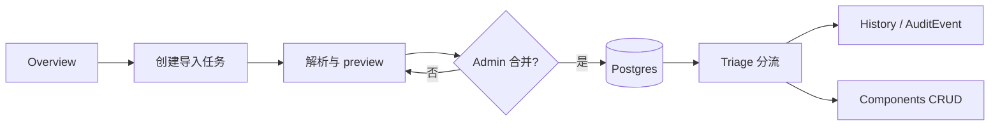

# Argus：漏洞分流工作台当前计划

本文只记录当前产品范围、作业要求、核心流程、未完成里程碑和文档依赖。运行步骤见 [README.md](../README.md)，UI 契约见 [DESIGN.md](../DESIGN.md)，长期取舍见 [技术决策](./decisions.md)。

## 1. 产品范围

Argus 面向 DevSecOps 和安全审查人员。它接收内置 SQL 来源，整理 CVE、Component 和 CPE 候选关系，支持搜索、审查、状态分流、Component CRUD、导入预览、合并和 AuditEvent。

已确认的边界：

- UI、错误消息和表单标签使用简体中文；品牌和展示标题保留英文。
- Guest 可以浏览、搜索和查看详情；Admin 才能执行 mutation、批量改状态和导入。
- 顶部搜索负责跨页面导航；Triage 搜索只筛选当前列表。
- CVE 只通过来源导入，不提供人工新增；Component 提供完整 CRUD。
- 不加入 Agent、自动修复或聊天能力。
- Demo mode 用于离线展示；真实持久化使用 Supabase Postgres 和 Supabase Auth。

## 2. 要求与验收入口

下表只保留“要求由哪里负责、用什么证据验收”，不重复实现细节。

| 要求                           | 责任入口                                                                             | 验收证据                                      |
| ------------------------------ | ------------------------------------------------------------------------------------ | --------------------------------------------- |
| 前端页面、响应式布局和 UI 状态 | [DESIGN.md](../DESIGN.md)、`src/components/`                                         | 浏览器路线、Playwright、截图或录屏            |
| HTTP 前后端边界                | [README.md](../README.md)、`src/client/http.ts`、`src/app/api/[[...route]]/route.ts` | API 请求、浏览器网络记录                      |
| CVE 查询、修改、删除和不新增   | `src/server/api/routes/cve.routes.ts`、[README API 摘要](../README.md#api-快速摘要)  | API regression、权限矩阵                      |
| Component 完整 CRUD            | `src/server/api/routes/component.routes.ts`、`src/components/components/`            | Guest／Admin API 和浏览器操作                 |
| 输入校验与统一响应             | `src/server/api/schemas.ts`、`src/server/api/helpers.ts`                             | 无效输入、错误响应和空／成功状态              |
| 可重复导入                     | `src/server/data/parser.ts`、`src/server/services/import.service.ts`、`prisma/`      | parser fixture、preview、merge、sourceMissing |
| 重启持久化                     | `prisma/migrations/`、`prisma/seed.ts`、README 数据库流程                            | migration、seed、重启后读取                   |
| 交付与发布                     | `docs/test-matrix.md`、`docs/release-checklist.md`                                   | 带日期、commit、环境和证据位置的记录          |

## 3. 产品流程

安全审查人员先在 Overview 查看风险分布和导入状态，再在 Triage 筛选 CVE，打开详情抽屉确认来源、影响和 CPE 候选，Admin 可以直接修改 triage 状态。来源更新时，Admin 创建导入任务，查看 checksum、摘要和差异，确认后合并；操作写入 AuditEvent。

## 4. 设计和技术边界

- UI 视觉、交互、文案、可及性和浏览器走查属于 [DESIGN.md](../DESIGN.md)。
- Node、pnpm、Next、Hono、Prisma、Supabase、QStash、Redis 和部署步骤属于 [README.md](../README.md)。
- 长期技术取舍属于 [docs/decisions.md](./decisions.md)。
- 机器 contract 以 `prisma/schema.prisma`、`src/types/domain.ts`、`src/constants/status.ts` 和 `src/server/api/schemas.ts` 为准。
- API 路由以 `src/server/api/routes/` 为准；OpenAPI 是辅助入口，新增路由时仍需检查 README 和测试矩阵。
- 计划不复制字段表、完整 token 表、环境变量步骤或当前测试结果。

## 5. 交付路线

里程碑表示工作顺序，不代表当前已经完成。完成状态必须写进测试或发布记录，不能只修改本表的文字。

| 里程碑            | 目标                                             | 依赖           | 进入下一阶段的条件                               |
| ----------------- | ------------------------------------------------ | -------------- | ------------------------------------------------ |
| M1 文档与运行基线 | 统一路由、架构边界、安装命令和文档语言           | 当前代码和配置 | README、AGENTS、DESIGN 和 docs 链接互相一致      |
| M2 数据层         | schema、migration、seed、parser 和来源数据       | M1             | parser fixture 和数据库流程可重跑                |
| M3 API 与权限     | CVE、Component、状态、审计和 Guest／Admin        | M2             | API contract、无效输入和权限测试有证据           |
| M4 核心 UI        | Triage、详情、编辑、Components、Overview、双搜索 | M3             | DESIGN 受影响路线完成浏览器检查                  |
| M5 导入与响应式   | preview、merge、retry、图表、批量操作和窄屏流程  | M4             | Import、移动端和 reduced motion 有测试记录       |
| M6 发布           | CI、production build、部署变量和文档同步         | M5             | release checklist 每项带日期、commit、环境和证据 |

## 6. 当前依赖和开放事项

- Supabase 免费项目可能暂停，演示必须保留 Demo fallback。
- QStash、Redis 和 OAuth 都是可选服务；缺失时不能阻塞本地读取和基本导入。
- 来源 SQL 字段变化必须先经过 parser fixture 和 preview，不能直接合并。
- API、schema、环境变量和 CI 变化必须按照 [AGENTS.md](../AGENTS.md) 的文件影响矩阵同步文档。
- DESIGN 中的字级、Sheet/Dialog 动效、响应式断点和 token 完整性仍需以 CSS 和浏览器证据校准，当前差异见 [DESIGN.md](../DESIGN.md#12-当前待核对差异)。

## 7. 相关记录

- 长期技术取舍：[docs/decisions.md](./decisions.md)
- 当前风险：[docs/risk-register.md](./risk-register.md)
- 验证覆盖：[docs/test-matrix.md](./test-matrix.md)
- 发布门槛：[docs/release-checklist.md](./release-checklist.md)
- AI 来源：[docs/ai-log.md](./ai-log.md)
- 看板流程：[docs/project-board.md](./project-board.md)

本文件不记录已完成截图、外部平台当前状态或某一轮测试的永久勾选；这些证据应进入带日期和 commit 的测试／发布记录。
