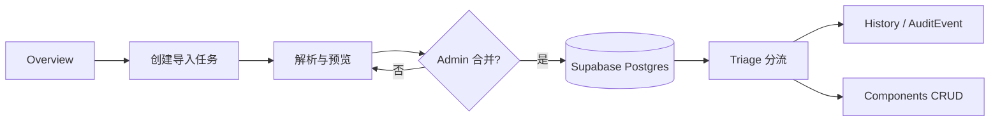
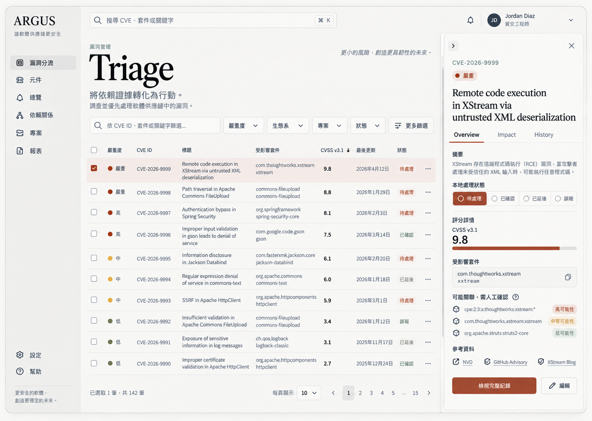

# Argus｜漏洞分流工作台：作业方案与交付计划

## 1. 首屏摘要

Argus 是一个面向 DevSecOps／安全审查人员的漏洞分流工作台。它把 `data/source/comp.sql`、`data/source/vul.sql` 作为可追溯来源，提供 CVE 搜索、详情审查、状态分流、Component CRUD、风险概览、导入预览与审计记录。

已确认决策：

- UI 操作文字全部使用简体中文；`Argus`、`Triage`、`Overview`、`History` 等品牌和展示标题保留英文。
- 首版采用亮色列表基准，低饱和暖灰背景、炭黑文字、陶土色风险强调；支持响应式布局与减少动效。
- 访客可浏览，单一 Admin 登录后可修改；不加入 Agent。
- 右侧详情抽屉直接快速修改状态，编辑内容使用独立工作区。
- 顶部搜索是全局导航入口；列表搜索只筛选当前 Triage 列表。
- 项目（Projects）实体与导航移除，避免展示层出现不存在的数据模型。

## 2. 作业要求与基础分验收矩阵

| 要求 | 实现 | 验收证据 |
| --- | --- | --- |
| 前端 | Next.js App Router、TailwindCSS、响应式 Triage／Components／Overview | 页面、Playwright smoke |
| 后端 | Hono REST API，统一 `/api/*` 路由 | `app/api/[[...route]]/route.ts`、OpenAPI |
| 数据库 | Supabase Postgres、Prisma 7 migration | `prisma/schema.prisma`、`prisma/migrations` |
| HTTP 通信 | UI 使用 fetch 调用 REST，浏览器不直连数据库 | `ArgusApp.tsx`、API demo 命令 |
| CVE 查询 | CVE ID、标题、描述、Component／PURL 关键字与状态／severity 参数 | `GET /api/cves`、`GET /api/search` |
| CVE 修改 | 标题、描述、severity、CVSS、CWE、affected versions | `PATCH /api/cves/:cveId` + Zod |
| CVE 删除 | Admin 确认后硬删；删除前写 `CVE_DELETED` | store DB branch、History／AuditEvent |
| CVE 不新增 | 没有 `POST /cves`；只从内建来源导入 | OpenAPI 路由表 |
| Component 完整 CRUD | 列表、搜索、抽屉表单、新增、修改、删除 | `/api/components`、ComponentEditor |
| 校验与反馈 | Zod、必填、格式限制、loading／empty／error／success／确认 | API response、UI states |
| 可重复导入 | parser、checksum、stage rows、upsert、sourceMissing | `prepareImportJob`、`mergeImportJob` |
| 重启持久化 | `DEMO_MODE=false` 时使用 Postgres；migration＋seed | `pnpm db:migrate`、`pnpm db:seed` |
| 交付材料 | README、方案、决策、风险、测试矩阵、AI log、发布清单 | `docs/` |
| 5–8 分钟演示 | 查询、修改、删除、Component CRUD、HTTP、导入预览／合并 | README 演示脚本 |

## 3. 创意方向验收矩阵

| 方向 | 首版可操作切片 | 设计理由 |
| --- | --- | --- |
| 精美 UI | 亮色 evidence-first 表格、抽屉、编辑工作区、Toast、删除确认 | 让安全证据密度高但不显得像后台模板 |
| RWD | Desktop 三栏信息层级；Tablet 收合导航；Mobile 卡片／全屏 Sheet | 同一资料模型适配演示和移动复核 |
| 交互反馈 | `Esc` 关闭、`Cmd/Ctrl + K`、焦点回收、loading／empty／error、reduced motion | 让短演示也能展示成熟交互 |
| 可视化 | severity／ecosystem 横向条形图、Critical／High 指标、Risk Index、导入差异样本 | 数据来自当前 store／数据库，不放假数字 |
| 产品拓展 | Guest／Admin、Email＋密码、可选 Google／GitHub、AuditEvent、批量状态 | 角色少而闭环完整，避免课程项目过度企业化 |
| 工程化 | Prisma 7 migration、Hono＋Zod、typed REST 约束、Vitest、Playwright、CI、生产 build | 每个亮点都有可运行验收点 |
| 全过程管理 | 需求、决策、风险、里程碑、测试、AI 记录、发布检查 | 将“做出来”变成“可复核交付” |

## 4. 产品故事与核心流程

角色是安全审查人员。一天开始时，管理员先在 Overview 查看未处理 Critical／High 和风险指标；随后从 Triage 列表确认高优先级 CVE，打开详情抽屉审查受影响组件和 CPE 候选，直接改变本地状态。需要修改源资料映射时进入编辑工作区。资料源有更新时，管理员先创建导入任务，查看 checksum、摘要和差异样本，确认后再合并；整个过程留下操作日志。

## 5. 视觉基准与交互说明

视觉基准图中的两个搜索框责任不同：

1. 顶部全局搜索支持 CVE、Component、PURL，并使用 `Cmd/Ctrl + K` 打开命令入口；结果可以导航到 CVE 详情或 Components 页面。
2. Triage 列表内搜索只请求／筛选当前漏洞列表，不改变全局导航上下文。

列表保持证据密度，详情使用右侧抽屉承载摘要、影响关系和 History。Admin 在抽屉内直接点击四种状态完成快速分流；标题、描述、CVSS、CWE、受影响版本进入独立编辑工作区，避免抽屉变成拥挤的长表单。

可访问性基线：语义按钮与表单标签、`role=dialog`、键盘关闭、清晰焦点、状态文字和 `prefers-reduced-motion`。目标对齐 [WCAG 2.2](https://www.w3.org/TR/wcag/) 和 [ARIA APG](https://www.w3.org/WAI/ARIA/apg/)。

## 6. 技术选型与免费边界

| 层 | 选择 | 为什么 | 免费边界／退路 |
| --- | --- | --- | --- |
| Web | Next.js 16 + Turbopack | 官方构建链、Vercel 部署路径短 | 不同时引入 Rspack／Rsbuild；除非出现明确 bundler 需求 |
| UI | TailwindCSS、shadcn 风格、Rare UI／Kibo／Cult 参考 | 允许保留品味而不锁死组件库 | 首版自有 token，避免多个 UI 库互相覆盖 |
| API | Hono + Zod + OpenAPI JSON | 路由轻、校验与文档同源 | Scalar 可在后续替换 `/api/docs` 静态页 |
| DB | Supabase Postgres + Prisma 7.10 | SQL 资料适合关系模型；迁移、事务、upsert 清晰 | 免费项目 500 MB，闲置可能暂停；可迁移到兼容 Postgres |
| Auth | Supabase Auth | Email／OAuth provider 配置统一 | 未配置 OAuth 不显示按钮；Demo mode 仍可离线演示 |
| Queue | Upstash QStash + Redis | 延迟、重试、签名验证；导入可观察 | QStash 免费层每日 1000 条；无凭证回退本地 worker |
| Deploy | Vercel Hobby | Next.js 零配置公开展示 | 仅个人／非商业演示，无生产 SLA |

## 7. 数据模型与字段映射

核心实体：`Cve`、`Component`、`CpeCandidate`、`ImportJob`、`ImportStageRow`、`AuditEvent`。

| 来源 | 正式字段 | 处理规则 |
| --- | --- | --- |
| `tmp_comp` | purl、cpe、type、vendor、name、version、license、description、repository、publishDate、language、recordTime | PURL 是主键；日期标准化；来源缺失只标记，不删除 |
| `tmp_vul` | sourceId、sourceName、sourcePublishDate、sourceUpdateDate、sourceLink、affectedVersion、cvssScoreV4／V3／V2、severity、type、cweId、description、cveId、title | `affectedVersion`／`cweId` 解析为 JSON 数组；`cveId` 唯一；本地 triageStatus 保留 |
| CPE 关系 | `CpeCandidate` | CPE vendor/name 前缀启发式；状态默认 CANDIDATE；Admin 确认或排除 |
| 操作 | `AuditEvent` | 登录、修改、删除、状态、批量、导入、合并、重试都有 action |

## 8. API 与权限边界

Guest 可以执行 GET：CVE、Component、Overview、Search、AuditEvent（展示只读摘要）、ImportJob 状态。Admin 才能执行 PATCH／DELETE、批量状态、候选审查、创建／合并／重试导入。API 在服务端使用 `resolveUser` 判断角色，不能只依赖前端隐藏按钮。

错误响应统一为 `{ ok: false, error: { message, details? } }`，成功响应使用 `{ data, meta? }`。`GET /api/openapi.json` 给出核心路由，`/api/docs` 为课堂演示入口。

## 9. 测试、CI、migration 与部署

GitHub Actions 顺序：

1. Node 24 + pnpm 12.6.0。
2. `pnpm install --frozen-lockfile`。
3. `pnpm lint`、`pnpm typecheck`、`pnpm test`。
4. 安装 Playwright Chromium，执行 `pnpm test:e2e`。
5. `pnpm db:generate`、`pnpm prisma validate`、`pnpm build`。

部署前把 Vercel 环境变量分为公开 Supabase URL／anon key 与服务器端 DATABASE／QStash signing key；生产设置 `DEMO_MODE=false`。公开展示默认保留 Guest 浏览入口，Admin 通过 Supabase Auth 登录。

## 10. 里程碑与依赖

| 里程碑 | 完成条件 | 依赖 |
| --- | --- | --- |
| M1 基线 | Node 24、pnpm、Next、Turbopack、Tailwind 启动 | 无 |
| M2 数据层 | schema、migration、398／1000 parser、seed | M1 |
| M3 API／权限 | CVE、Component、状态、审计、Guest／Admin | M2 |
| M4 核心 UI | Triage、抽屉、编辑、Components、Overview、双搜索 | M3 |
| M5 创意切片 | RWD、图表、Risk Index、批量、导入 preview／merge／retry | M4 |
| M6 交付 | Vitest、Playwright、CI、README、飞书方案、Vercel 展示 | M5 |

## 11. 风险与备选

详见 [风险登记表](./risk-register.md)。最高优先级风险是免费服务暂停、QStash 凭证缺失、来源 SQL 变化和数据库连接池配置；每项都有本地回退或可重复 migration，不改变业务 API。

## 12. AI 使用记录与验收证据

每次使用 AI 记录工具、提示词摘要、采纳／修改／否决的建议和验证命令，模板见 [AI 使用记录](./ai-log.md)。提交前按 [发布前检查表](./release-checklist.md) 逐项勾选，并保存终端、浏览器和飞书回读证据。

任务看板的列与卡片规则见 [GitHub Projects 看板](./project-board.md)。当前仓库未绑定远端 GitHub 项目，因此先把可直接创建的列、示例卡片和进入条件写入交付物。
